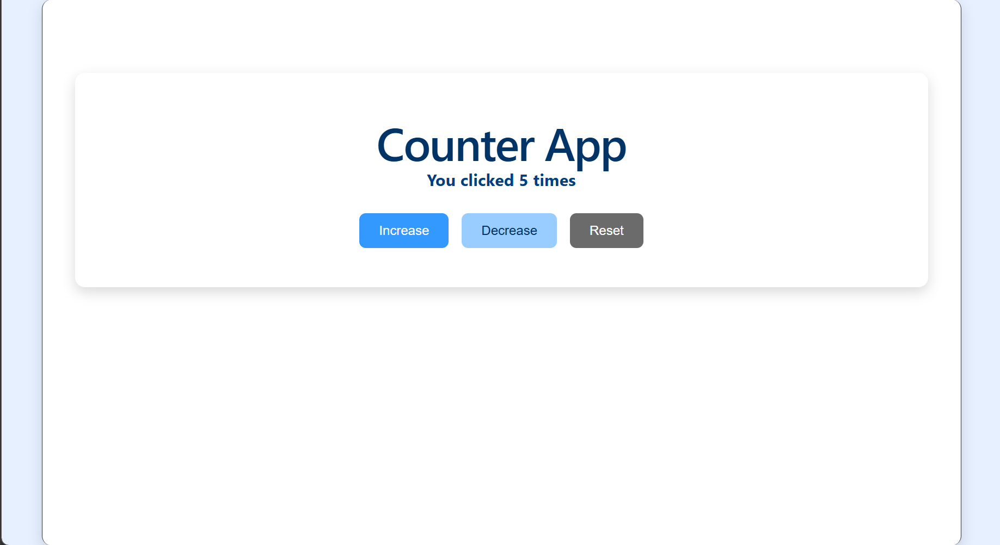

# React Counter App

A modern, responsive counter web application built with React and Vite. It utilizes React Hooks (`useState` and `useEffect`) for state management and persists data across page refreshes using the browser's `localStorage` API.

---

## Live Demo & Video Preview

- **Video Walkthrough:** [Click here to watch the full demo](https://your-video-link-here.com)
- **Live Deployment:** [View the Live App](https://your-live-deployment-link.com) 

---
 📸 Screenshots

| Initial State | After Increments |
| :---: | :---: |
|  |  |git add README.md

---

##  Features

- **Increment & Decrement:** Adjusts the count value in real time.
- **Reset:** Instantly resets the counter back to zero.
- **Data Persistence:** Uses `useEffect` and `localStorage` to save the counter state across browser reloads.
- **Document Title Sync:** Dynamically updates the browser tab title to reflect the current count.
- **Clean UI:** Styled with responsive, centered inline CSS.

---

## 🛠️ Tech Stack

- **Framework:** React (Vite template)
- **Language:** JavaScript 
- **Styling:** Inline Styles
- **Storage:** Browser Web Storage API (`localStorage`)

---

## ⚙️ Installation and Setup Instructions

Follow these steps to run the project locally on your machine:

### 1. Prerequisites
Ensure you have [Node.js](https://nodejs.org/) installed (version 18 or higher recommended). Verify in your terminal:
```bash
node -v
npm -v